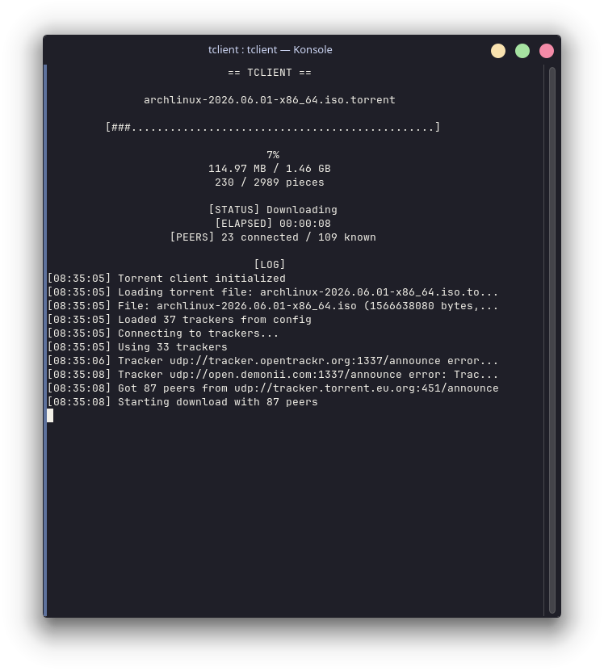
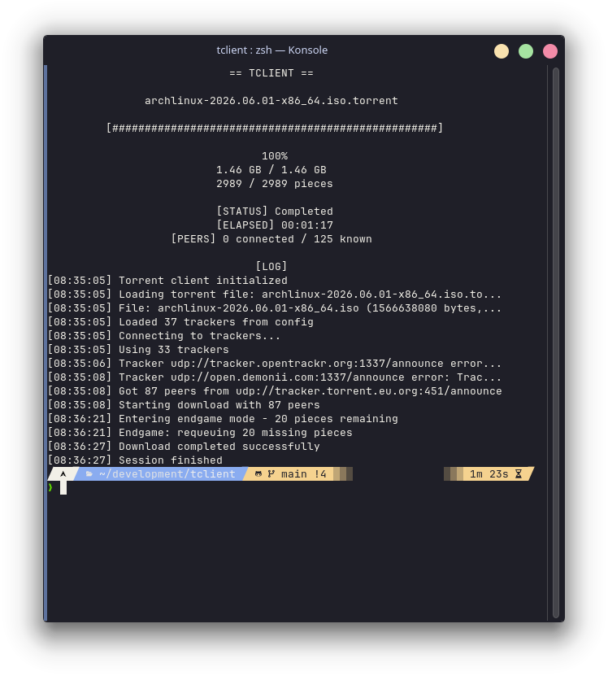

### Torrent-Client

A BitTorrent client written in C++ that supports downloading **single-file torrents** using **HTTP and UDP trackers**.  
The project features a **multi-threaded architecture** and a self-written **text-based user interface (TUI)**.
No external libraries are required.

**Note 1:**
This project originally started as a university assignment and is now being refactored and improved.

**Note 2:**
All networking operations (HTTP and UDP tracker communation, peer-to-peer communication, and piece downloading from peers) are implemented using plain POSIX sockets.

## Screenshots



## Features
- Single-file torrent downloads
- Multi-threaded peer connections
- HTTP and UDP tracker support
- Compact peer protocol support
- Text User Interface (TUI)

## Dependencies
Required
- C++20 compatible compiler
- CMake (3.14 or higher)

## Build
```bash
git clone https://github.com/n3tw4lk3r/Torrent-Client
cd Torrent-Client
mkdir build && cd build
cmake -DCMAKE_EXPORT_COMPILE_COMMANDS=ON ..
make -j$(nproc)

```
## Usage

```bash
# in Torrent-Client/build
# make sure you have output-directory created
src/simple-torrent-tui <torrent-file> <output-directory>
```

### Example

```bash
# in Torrent-Client/build
# downloads is created before executing the command
src/simple-torrent-tui ../resources/ubuntu-25.10-live-server-amd64.iso.torrent downloads
```

## Main Components

The project is split into several logical modules, each responsible for a distinct part of the BitTorrent protocol and application workflow.

### Core

- **TorrentClient**  
  The central orchestrator of the download process.  
  Coordinates trackers, peer connections, piece storage, and overall torrent state.

- **TorrentFile**  
  Represents parsed .torrent metadata, including piece hashes, announce URLs, and file information.

- **HttpTracker**  
  Handles communication with HTTP/TCP trackers.

- **UdpTracker**  
  Handles communication with UDP trackers.

- **PieceStorage**  
  Manages torrent pieces and blocks, tracks download progress, verifies piece hashes, and writes completed data to disk.

- **Piece**  
  Represents a single torrent piece split into blocks and tracks block-level download state.

### Networking

- **PeerConnection**  
  Manages communication with a single peer: handshake, bitfield exchange, piece requests, and message processing.

- **TcpConnection**  
  Low-level abstraction over TCP sockets used for peer communication.

- **UdpConnection**  
  Wrapper over UDP sockets, used primarily for tracker communication.

### Protocol & Utilities

- **Message**  
  Encapsulates BitTorrent peer protocol messages and provides parsing and serialization logic.

- **BencodeParser**  
  Parses Bencode-encoded data from strings and .torrent files.

## Limitations
- Supports only single-file torrents (no multi-file/directory structure)
- No seeding/upload capability
- No DHT support
- No magnet link support

## Planned Features and Fixes:

### Near Future
- Calculate and display download speed

### Someday
- Multi-file torrent support
- Seeding/upload support

